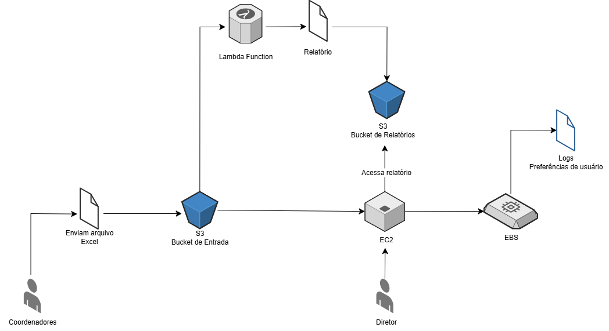

# Gerenciando Instâncias EC2 na AWS

Repositório para armazenar resumo e desafio do módulo "Gerenciando Instâncias EC2 na AWS" do Curso de AWS do Santander Code Girls 2025 da [Digital Innovation One](https://www.dio.me/).

## 📃 Documentação
- [Documentação EC2](https://docs.aws.amazon.com/pt_br/ec2/)
- [Documentação S3](https://docs.aws.amazon.com/pt_br/s3/?icmpid=docs_homepage_featuredsvcs)
- [Documentação EBS](https://docs.aws.amazon.com/pt_br/ebs/?id=docs_gateway)
- [Documentação AWS Lambda](https://docs.aws.amazon.com/lambda/)

## 🖥️ Resumo das Aulas

No módulo **Computação na Nuvem com EC2**, aprendemos sobre diferentes serviços ofertados na AWS, as diferenças técnicas e práticas entre eles, bem como a aplicabilidade de cada um.

**EC2** - “Elastic Compute Cloud”

É uma máquina virtual que pode ser conectada na nuvem. 
Uma EC2 é composta por: CPU, Memória, Disco, Rede, Sistema Operacional (Linux, Windows).
Pode ser configurada para rodar sites, banco de dados, API, etc.
É do tipo IaaS (infraestrutura como Serviço).
Conta com diversos tipos de instâncias, proporcionando a possibilidade de otimização de recursos. 

**EBS** - “Elastic Book Store”

Disco rígido virtual altamente confiável, que pode ser anexado em qualquer instância EC2. Funciona como o “HD/SSD” de um computador.
Cria uma nova partição na instância.
Escolhemos modelo e tamanho e anexamos à nossa VM.
Exemplo de uso: Armazenamento persistente (ou seja, não se perde quando o servidor desliga). Armazenamento para banco de dados (ex.: MySQL, PostgreSQL, Oracle); aplicativos web e logs de sistema.

**S3**  - “Simple Storage Service”

É um serviço de armazenamento de objetos em nuvem. 
Funciona como um “disco rígido online” para guardar arquivos.
Armazena, organiza e recupera grandes volumes de dados de forma segura e escalável. São criados “baldes” (buckets) onde os arquivos são colocados dentro (como imagens, documentos, vídeos, backups).

Possui classes de storages onde conseguimos economizar nos custos. Ou seja, é um tipo de armazenamento barato e escalável.
Regra do ciclo de vida - definir a forma como o Amazon S3 gere os objetos durante o seu tempo de vida. O Lifecycle permite fazer a transição de objetos e migrar automaticamente para a classe Glacier, trazendo economia nos custos.

**AWS Lambda**

Serviço para rodar funções (códigos pequenos) sem precisar manter um servidor.
É definido um código (em uma linguagem, como Python) e quando ele deve rodar (exemplo, sempre que um arquivo for enviado no S3).
Serve para automação, tarefas rápidas, processamento de eventos (upload de arquivo, novo log, etc). 

**Entendidos os conceitos de cada serviço, agora vamos para o desafio prático de Arquitetura.**

## 📚 Desafio  

Criar o desenho de uma arquitetura utilizando todos os serviços aprendidos durante o módulo: S3, EC2, Lambda Function, EBS, utilizando o [Draw.io](Draw.io).

**Cenário**

Uma empresa precisa armazenar planilhas de vendas enviadas periodicamente pelos times regionais. A diretoria pediu para que essas informações sejam consolidadas, devendo retornar métricas em forma de relatórios. Esses relatórios devem ainda ser facilmente acessados pela diretoria, pois serão utilizados para importantes tomadas de decisões e apresentação de resultados.

**Arquitetura**

**Explicação**

1) O processo se inicia com o envio da planilha de Excel para o S3 (Bucket de Entrada);

2) Cada upload dispara uma Lambda Function, que processa o arquivo e consolida os dados, calcula métricas básicas como total de vendas e média por região, etc.

3) A Lambda gera um relatório em PDF e salva no segundo S3 (Bucket de Relatórios);

4) O diretor acessa o relatório por meio de um painel localizado na instância EC2;

5) Esse painel mantém logs e preferências de usuários no volume EBS.

## ✅ Conclusão

Nesse capítulo, aprendemos sobre variados serviços da AWS e a como desenvolver projetos de arquitetura utilizando o draw.io. O desafio me permitiu entender melhor como funciona cada um deles, e fui encorajada a pensar em um caso fictício que englobasse todos os conhecimentos passados até aqui, buscando soluções que se aplicariam a problemas reais de negócio.