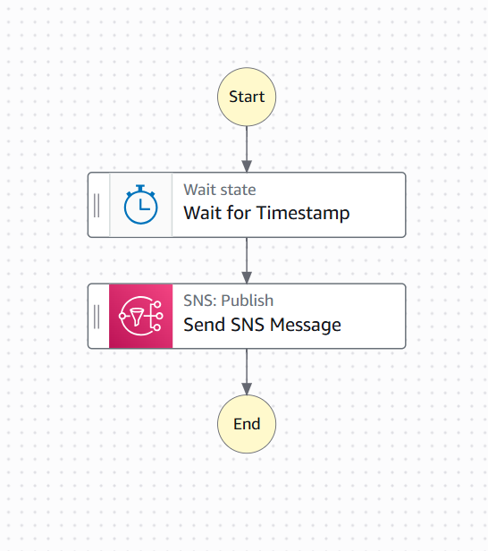

# Explorando Workflows Automatizados com AWS Step Functions

Bootcamp Santander Code Girls 2025

## Descrição do Repositório

Este repositório reúne conteúdo e exemplos desenvolvidos durante o módulo “Explorando Workflows Automatizados com AWS Step Functions”. O objetivo é demonstrar a orquestração de processos serverless na AWS.

## O que é AWS Step Functions

AWS Step Functions é um serviço gerenciado para criação e execução de workflows serverless por meio de máquinas de estado. Ele permite coordenar serviços da AWS com controle sobre sequenciamento, paralelismo, lógica condicional e tratamento de falhas, oferecendo monitoramento visual e métricas integradas.

## Características Principais

* Orquestração visual de processos com logs e histórico detalhado
* Escalabilidade automática e execução totalmente gerenciada
* Integração nativa com diversos serviços, como Lambda, DynamoDB, SQS, SNS, ECS e S3
* Suporte a tratamento de erros, tentativas automáticas e ramificações alternativas

## Casos de Uso

* Orquestração de micro-serviços
* Processamento de dados e ETL
* Automação de processos corporativos
* Workflows com etapas humanas
* Execução coordenada de tarefas assíncronas distribuídas

---

## Exemplo de Arquitetura

O fluxo de trabalho simula o agendamento de uma ação: uma notificação é enviada por meio do Amazon SNS somente após um período de espera pré-definido.
A Máquina de Estados é composta por uma sequência de três passos, ilustrando a transição de dados entre eles:
Estado Pass (Injetar Dados): Inicia o fluxo, injetando um input JSON simples (contendo a mensagem e o assunto da notificação).
Estado Wait (Temporizador): Pausa a execução do workflow pelo número de segundos configurado. Este estado é crucial para agendamentos e demonstra o controle de tempo do Step Functions.
Estado Task (SNS Publish): Após a espera, o Step Functions invoca diretamente a API do Amazon SNS para publicar a mensagem injetada no primeiro passo.

O projeto foca em:
Controle de Tempo: Uso do estado Wait.
Sequência e Fluxo de Dados: A saída do estado Pass se torna a entrada para o estado Task (SNS Publish).
Integração Direta: O Step Functions publica no SNS sem a necessidade de código Lambda, simplificando a arquitetura.

---

## Tecnologias Utilizadas

* AWS Step Functions
* Amazon SNS

---

## Créditos

Projeto desenvolvido como parte do Bootcamp **Santander Code Girls 2025**.

---
