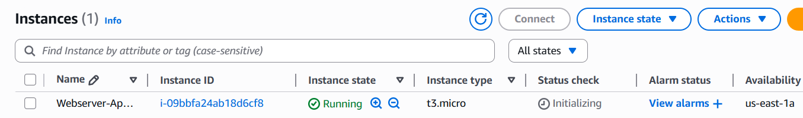

# Implementando a Primeira Stack com AWS CloudFormation

Bootcamp Santander Code Girls 2025

## Descrição do Repositório

Este repositório reúne conteúdo e exemplos desenvolvidos durante o módulo “Implementando a Primeira Stack com AWS CloudFormation”. O objetivo é demonstrar o provisionamento de uma instância EC2 (Elastic Compute Cloud) com um servidor web Apache instalado e configurado, aplicando os princípios de Infraestrutura como Código (IaC).

## O que é AWS CloudFormation

AWS CloudFormation é um serviço da AWS que permite modelar e provisionar recursos de infraestrutura em nuvem de forma automatizada e repetível. Ele utiliza templates declarativos (em YAML ou JSON) para descrever todos os recursos necessários, gerenciando o ciclo de vida completo do Stack (criação, atualização e exclusão). Isso garante consistência e elimina a necessidade de gerenciamento manual de recursos.

## Características Principais e Conceitos Aplicados

* Infraestrutura como Código (IaC): Utilização de um template YAML para definir e gerenciar os recursos, garantindo a reprodutibilidade do ambiente.
* Provisionamento de Instância EC2: Definição do recurso AWS::EC2::Instance com propriedades específicas (ImageId, InstanceType, AvailabilityZone, Tags).
* Bootstrapping com User Data: Uso da propriedade UserData para incorporar um script de shell. Este script automatizou a instalação, inicialização e configuração do servidor web Apache na instância EC2.
* Funções Intrínsecas do CloudFormation: Aplicação da função Fn::Base64 para codificar o script de UserData, conforme exigido pelo serviço.
* Ciclo de Vida da Stack: Entendimento e acompanhamento das etapas de criação, eventos e status de conclusão da Stack no console do CloudFormation.

## Casos de Uso

* Provisionamento Rápido: Lançar ambientes de desenvolvimento ou produção de forma ágil e padronizada.
* Gerenciamento Centralizado: Administrar todos os recursos de uma aplicação como uma única unidade (Stack).
* Consistência de Ambiente: Garantir que o mesmo conjunto de recursos seja implantado em diferentes regiões ou contas.
* Controle de Versão: Gerenciar as mudanças na infraestrutura (configuração, adição ou remoção de recursos) através do controle de versão dos templates.

---

## Desafio

As stacks foram criadas com os templates disponibilizados.

Criação da Stack: O CloudFormation lê o template firewall.yaml.

Provisionamento da EC2: O recurso AWS::EC2::Instance é criado com as especificações definidas.

Execução do User Data: No momento da inicialização (boot), o script de UserData é executado, transformando a máquina virtual em um servidor Apache funcional.

O projeto demonstra:

Sequência e Automação: A instalação e configuração do servidor ocorrem automaticamente, sem intervenção manual após o lançamento da Stack.

Integração Direta: O template coordena o provisionamento da instância EC2 e a configuração inicial do software sem a necessidade de um serviço intermediário.

## Problemas e soluções

Os códigos precisaram ser alterados, já que o t3.micro não está disponível em Free Tier.

Após a alteração do parâmetro, recriei a stack e funcionou normalmente, conforme a imagem abaixo que comprova a criação da instância.

---

## Tecnologias Utilizadas

* AWS CloudFormation
* AWS EC2 (Elastic Compute Cloud)
* Servidor Web Apache
*Linguagem YAML

---

## Créditos

Projeto desenvolvido como parte do Bootcamp **Santander Code Girls 2025**.

---