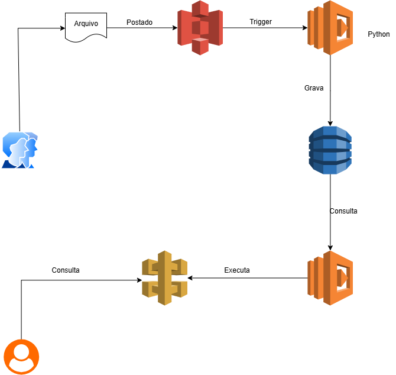

# Executando Tarefas Automatizadas com Lambda Function e S3

Bootcamp Santander Code Girls 2025

## Descrição do Repositório

Este repositório reúne conteúdo e exemplos desenvolvidos durante o módulo “Executando Tarefas Automatizadas com Lambda Function e S3", utilizando o LocalStack.

---

## O que é a AWS Local com LocalStack

* Projeto OpenSource que permite a simulação local da AWS. Oferece uma versão Open Source, gratuita e com suporte para vários serviços. Seu objetivo é oferecer um local para o desenvolvimento, teste e integração de serviços em nuvem sem a necessidade de utilizar a plataforma da AWS. Também existe a função PRO com mais funções e recursos. 

* Vantagens: economiza tempo e recrusos especialmente em testes de automação.

* Serviços suportados: Lambda, API Gateway, S3, DynamoDB, SNS, SQS, Cloudformation e outros.

---

## Projeto HandsOn

# Upload de Arquivos em Processamento e Registro no DynamoDB - Criando a arquitetura

Fluxo do Projeto:
1. O usuário faz upload de um arquivo (ex.: CSV ou JSON) em um bucket S3;
2. Um evento no S3 dispara uma Lambda Function escrita em Python;
3. A Lambda processa o conteúdo do arquivo (extrai informações) e grava esses dados em uma tabela no DynamoDB;
4. Outra função Lambda irá consultar a tabela e expor os dados por meio de uma API Gateway.

---

# Caso Real: Sistema de Processamento de Notas Fiscais

1. O usuário envia um arquivo JSON contendo informações de uma nota fiscal (número, cliente, valor, data, etc);
2. A Lambda lê e valida o arquivo, depois grava no DynamoDB os campos relevantes.

---

## Utilizando o LocalStack

1. Efetuar a instalação no site oficial;
2. Confirmar a instalação no PowerShell;
3. Executar utilizando lotalstack start no terminal;
4. Criar os recursos no aplicativo;
5. Tarefas para configuração (feitos no PowerShell):
    - Criar Bucket S3 chamado notas-fiscais-upload;
    - Criar tabela no DynamoDB: nome NotasFiscais, com chave primária id;
    - Criar Lambda Function: configurar permissões para acesso ao S3 e DynamoDB;
    - Criar o trigger do S3: configurar o bucket para disparar a Lambda ao fazer o upload de arquivos.
    - Criação do API Gateway.
6. As criações se refletem no browser;
7. Código python gera os dados com clientes fictícios ("Arquivo" na arquitetura);
8. NoSQL Workbench: conecta ao LocalStack;
9. Arquivo de teste é enviado para testar se Lambda e S3 estão funcionando;
10. Arquivo adicionado ao Bucket; 
11. Conferir eventos com CloudWatch Log Events;
12. Quando o arquivo apresenta erro (por exemplo, com erro de formatação) é gerado um alerta de erro e não é processado.

---

## Tecnologias Utilizadas

* Amazon S3
* AWS Lambda
* Amazon DynamoDB
* IAM
* Opcional: API Gateway (para exposição dos dados)
* LocalStack

---

## Créditos

Projeto desenvolvido como parte do Bootcamp **Santander Code Girls 2025**.

---
